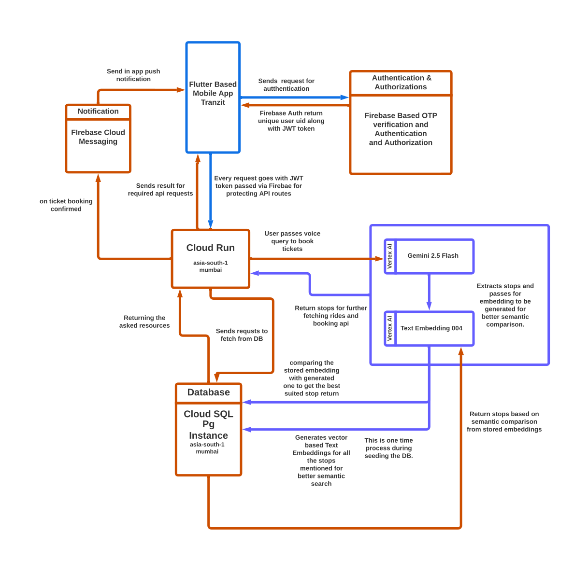
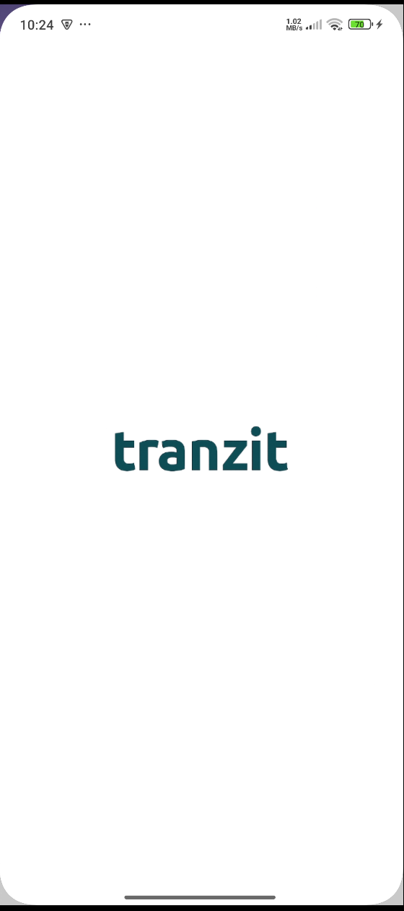
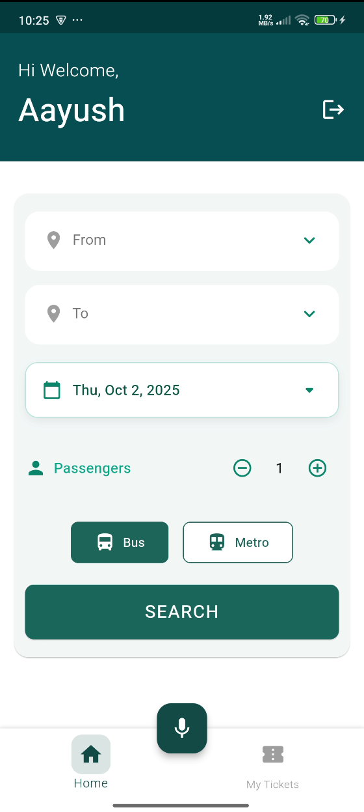
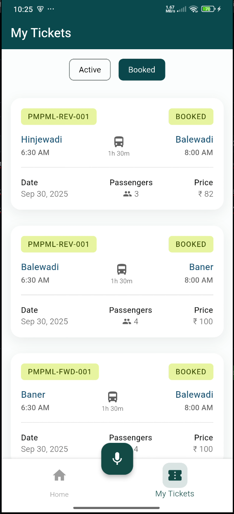
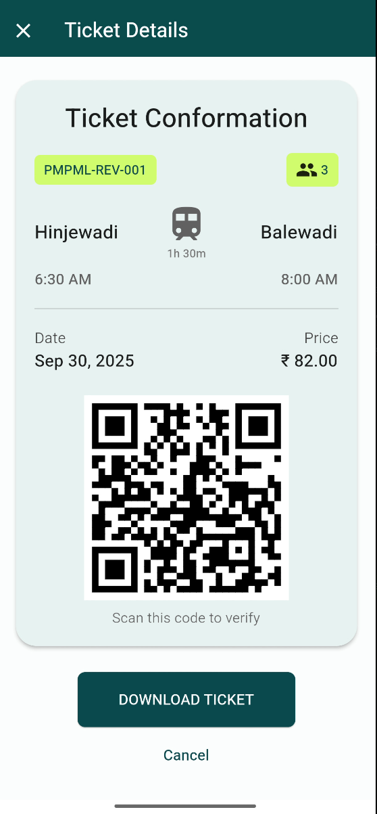
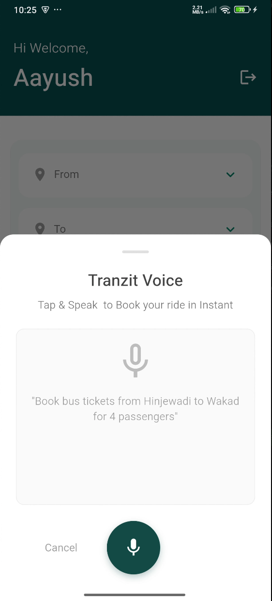
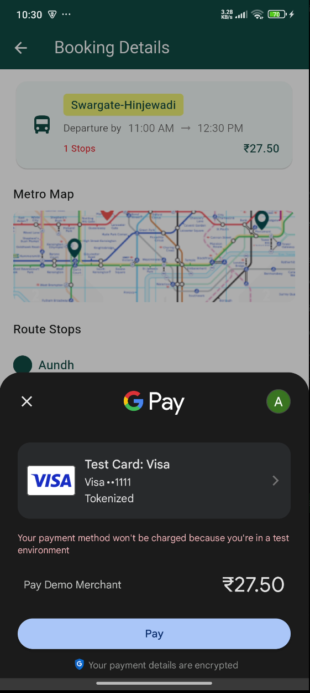

# 🚏 Tranzit

Tranzit is a smart transit booking platform that allows users to book tickets, verify them via QR codes, and manage travel seamlessly.  
It consists of a Flutter-based mobile app and a TypeScript backend powered by Cloud Run and Cloud SQL.

---

## ✨ Features

### Mobile App (Flutter)
- 🔐 **Firebase Authentication** (Email/Phone/Google login)
- 📲 **Intuitive booking flow** with clean UI
- 🎟️ **Ticket booking** with QR code generation & verification
- 🔔 **Push notifications** via Firebase Cloud Messaging
- 🗣️ **AI-powered voice ticket booking** (Vertex AI integration)
- 🌐 **Runs on Android & iOS**

### Backend (TypeScript + Node.js)
- 🛠️ **Built with TypeScript + Express**
- 📦 **Prisma ORM with PostgreSQL** (Cloud SQL)
- 🔑 **Role-based access** (Admin, User, Service Desk)
- 🚀 **Deployed on Google Cloud Run**
- 🧠 **Text embeddings** (Gemini / Vertex AI) for intelligent query processing
- ✅ **REST APIs** for ticket booking, QR validation, and user management

---

## 🛠️ Tech Stack

### Frontend (Mobile App)
- Flutter
- Dart
- Firebase Auth & FCM
- QR Code integration (`qr_flutter`)

### Backend
- Node.js + TypeScript
- Express.js
- Prisma ORM
- PostgreSQL (Cloud SQL)
- Google Cloud Run
- Vertex AI / Gemini APIs

---

## 📁 Project Structure
tranzit/
  - tranzit-app/                # Flutter mobile app
      - lib/                    # Dart source code
      - pubspec.yaml            # Flutter dependencies
  
  - tranzit-ts-backend/         # TypeScript backend
      - src/
          - controller/         # API controllers
          - services/           # Business logic
          - repository/         # DB access via Prisma
          - utils/              # Helper functions
      - prisma/                 # Prisma schema & migrations
      - package.json
      - tsconfig.json
  
  - README.md

---

## 📸 Architecture

  

---

## 📸 ScreenShots

  
  &nbsp;&nbsp;&nbsp;
  

  
  &nbsp;&nbsp;&nbsp;
  

  
  &nbsp;&nbsp;&nbsp;
  

---

